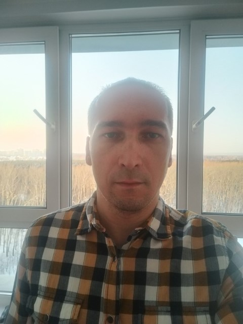

# Введение

Привет! Меня зовут **Юрий Рупасов**, и я учусь в Нетологии. Я увлекаюсь разработкой на Python и постоянно стремлюсь изучать новые технологии и подходы в IT-индустрии. Вот немного больше обо мне ⬇️

## О себе

- **Имя:** Юрий Рупасов
- **Возраст:** 45 лет
- **Город:** Новосибирск, Россия

## Образование

Я обучаюсь в [Нетологии](https://netology.ru) на курсе "Python-разработчик: расширенный курс". Курс включает в себя обучение:

- Основы языка программирования Python
- Git - система контроля версий
- ООП и работа с API
- Базы данных для python-разработчиков
- Профессиональная работа с Python
- Django: создание backend-приложений
- Python в веб-разработке
- Дипломный блок профессии Python-разработчик
  -Создание сервиса заказа товаров для розничной сети.

## Навыки

Вот список моих основных навыков:

### Основы языка программирования Python
- Понимание синтаксиса и базовых конструкций Python.
- Работа с переменными, типами данных и операторами.
- Использование циклов и условных операторов.
- Основы работы с функциями и модулями.

### Git - система контроля версий
- Создание и клонирование репозиториев.
- Основы работы с ветками (branching) и слияниями (merging).
- Ведение истории изменений с использованием коммитов.
- Разрешение конфликтов и откат изменений.

### ООП и работа с API
- Понимание принципов объектно-ориентированного программирования (ООП): классы, объекты, наследование, инкапсуляция.
- Создание и использование API в Python.
- Работа с RESTful API: GET, POST, PUT, DELETE запросы.
- Интеграция внешних API в собственные проекты.

### Базы данных для Python-разработчиков
- Основы работы с реляционными базами данных (SQL).
- Использование SQL-запросов для извлечения, вставки, обновления и удаления данных.
- Подключение Python-приложений к базам данных через ORM (например, SQLAlchemy).
- Оптимизация запросов и работа с транзакциями.
- PostgreSQL, Dbeaver

### Профессиональная работа с Python
- Использование виртуальных окружений для управления зависимостями.
- Работа с пакетами и библиотеками в Python.
- Обработка ошибок и исключений.
- Написание и использование unit-тестов для проверки кода.

### Django: создание backend-приложений
- Основы работы с фреймворком Django.
- Создание и настройка моделей, представлений и шаблонов.
- Настройка маршрутизации и URL-путей.
- Реализация аутентификации и авторизации пользователей.

### Python в веб-разработке
- Создание и настройка веб-приложений на Python.
- Работа с фронтендом в рамках веб-приложений на Django.
- Использование Django Rest Framework для создания API.
- Интеграция сторонних сервисов в веб-приложения.

### Дипломный блок профессии Python-разработчик
#### Создание сервиса заказа товаров для розничной сети
- Проектирование архитектуры веб-приложения.
- Реализация функционала корзины покупок и системы оплаты.
- Обеспечение безопасности данных пользователей.
- Тестирование и деплой сервиса на продакшн-сервер.

## Проекты

Вот несколько проектов, над которыми я работал:

- [Проект 1](https://netology.ru/sharing/9c164d1209726add2c1e7a9431414ba2?utm_source=social&utm_campaign=certificate_lms ) — Веб-приложение для планирования задач на день.
- [Проект 2](https://netology.ru/sharing/2b12b578465cbff64cd189f2626667b6?utm_source=social&utm_campaign=certificate_lms ) — Лэндинг для малого бизнеса.

## Хобби и интересы

В свободное время я люблю:

- Пробежки в парке 🏃
- Мотопутешествия 🌍
- Изучать новые возможности для программирования 💻

## Связаться со мной

- **Email:** solomindavid10@gmail.com
- **GitHub:** [github.com/ByteBard](https://github.com/Dogafas)

---

*P.S. Этот README файл был создан в рамках обучения на курсе Нетологии. Для выполнения практического домашнего задания. Не всё является правдой :-)* 
